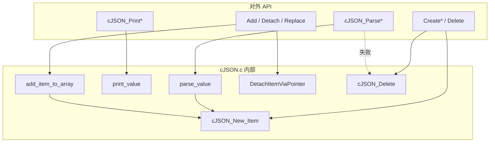
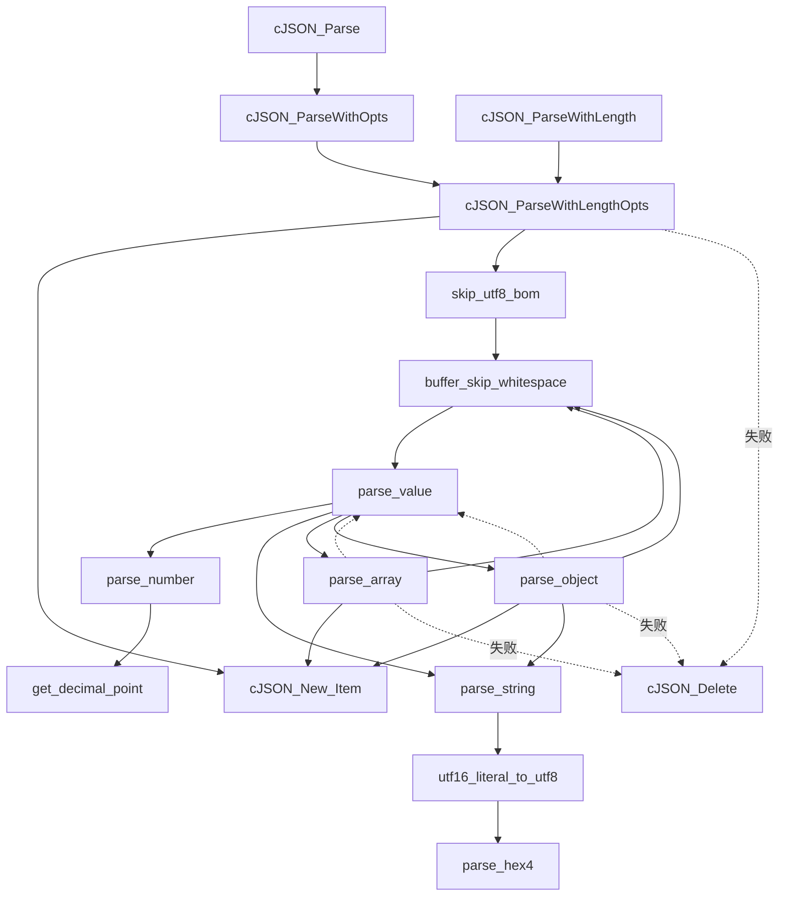
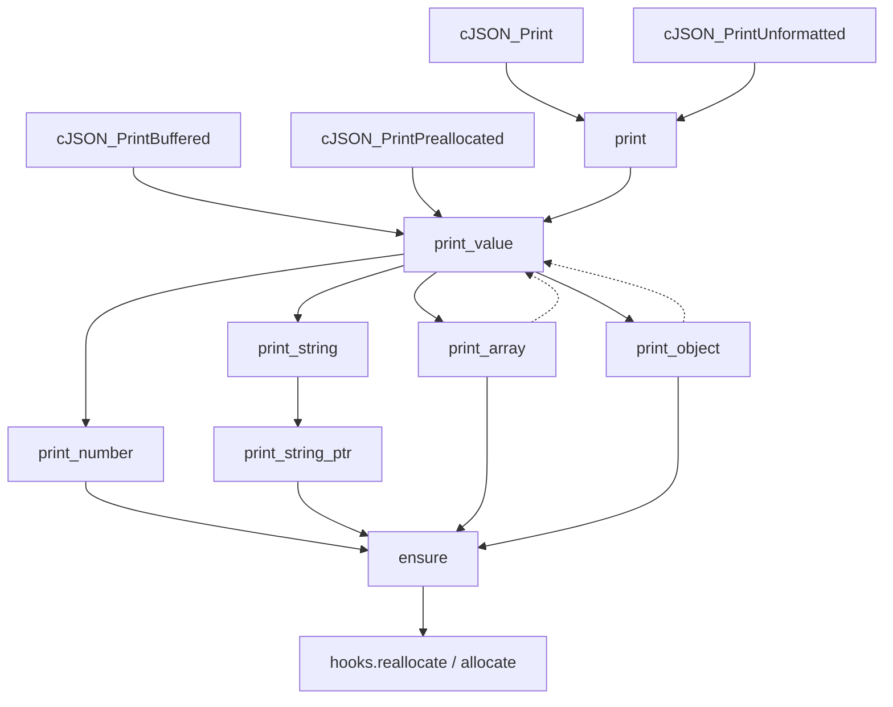
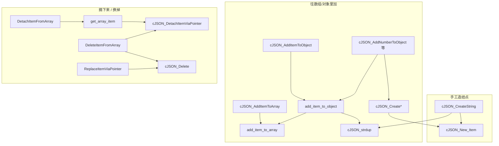
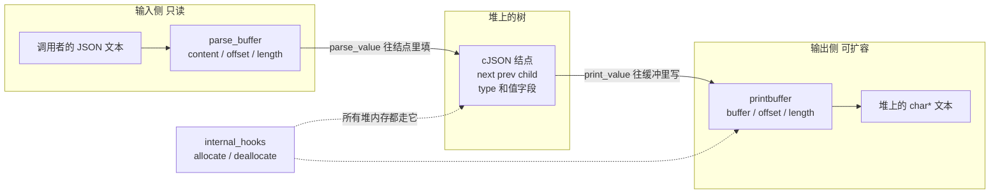
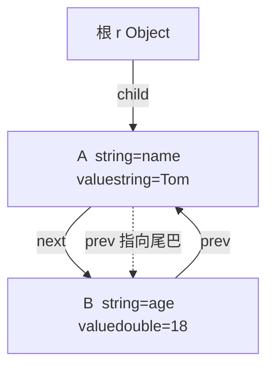
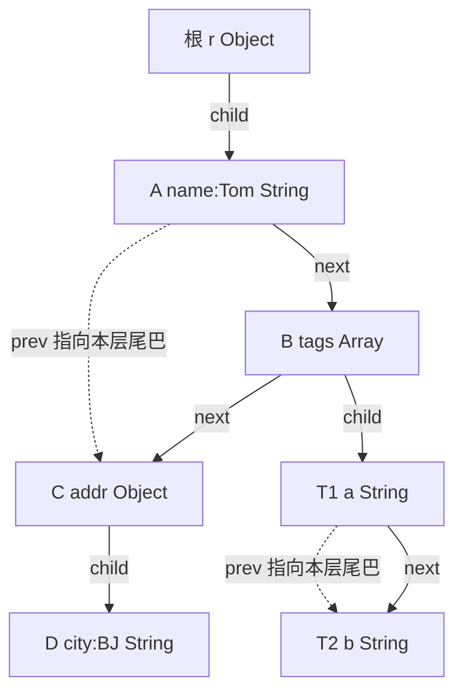

# cJSON 源码问答

配合 `cJSON.c` / `cJSON.h` 里的逐行注释。本文整理自学时问过的问题，按阅读顺序排。

相关材料：`阅读指南.md`（语法总表与阅读顺序）、`README.md`（官方 API）。

---

## 0. `cJSON.c` 函数调用图

`cJSON.c` 可以看成四条线：**解析、打印、改树、建/删结点**。对外 API 在上面，`static` 内部函数在下面。箭头表示“谁调用谁”；虚线是递归。

### 总览



读源码时抓住两对分发函数就够：`parse_value` / `print_value` 按类型往下派；`add_item_to_array` / `DetachItemViaPointer` 改孩子链表。

### 解析：文本 → 树



`parse_array` / `parse_object` 每个元素再调 `parse_value`，所以是递归。`parse_number` / `parse_string` 还通过 `buffer.hooks.allocate` 要内存，图里没画，当成 `malloc` 即可。

### 打印：树 → 文本



`ensure` 是打印侧的扩容：缓冲不够就 `realloc`（或新分配再拷贝）。`print_array` / `print_object` 对每个孩子再调 `print_value`，同样是递归。

### 改树与建结点



`add_item_to_object` 先填好键名 `string`，再复用 `add_item_to_array` 接到 `child` 链表末尾。`Detach` 只改指针、不 `free`；真正释放走 `cJSON_Delete`（递归删 `child`，循环删 `next`）。

### 和本文后面几节的对应

| 图上的函数 / 结构 | 问答节 |
|------------------|--------|
| 核心结构体 | 下面「核心数据存储结构」 |
| `CJSON_CDECL` / hooks | 第 1、2 节 |
| `parse_number` | 第 3 节 |
| `cJSON_ParseWithLengthOpts` | 第 4 节 |
| `parse_value` / `parse_array` / `parse_object` | 第 5、6 节 |
| `parse_string` / `utf16_literal_to_utf8` | 第 7、8 节 |
| `add_item_to_array` / `DetachItemViaPointer` | 第 9、10 节 |

---

## 核心数据存储结构

cJSON 不把 JSON 存成一块连续的「文档对象」，而是**很多个堆上的 `cJSON` 结点**，用三个指针拼成「树 + 双向链表」。解析、打印、改树都围着这几样转。

### 它们怎么配合



一句话：`parse_buffer` 是读光标，`cJSON` 是树结点，`printbuffer` 是写缓冲，`hooks` 是这一套的 malloc/free。

### `cJSON`：一个结点一种值

定义在 `cJSON.h`。每个 JSON 值（数字、字符串、数组里的一项、对象里的一对键值）都是一个这样的结点。

| 字段 | 存什么 |
|------|--------|
| `next` / `prev` | 右边 / 左边的兄弟。数组元素、对象成员都是兄弟 |
| `child` | 第一个儿子。只有数组、对象有；数字和字符串这里是 `NULL` |
| `type` | 类型比特（Number / String / Array …），还可或上 `IsReference` 等标志 |
| `valuedouble` / `valueint` | 数字。`valueint` 是截断后的 int，超出就夹到 `INT_MAX` / `INT_MIN` |
| `valuestring` | 字符串（或 raw）的堆上正文 |
| `string` | 若这个结点是对象的成员，这里是**键名**；否则是 `NULL` |

`type` 用左移得到互不重叠的位：`cJSON_Number` 是 `1 << 3`。判断用 `type & cJSON_Number`，不要 `==`，因为可能同时带着 `IsReference`。

键名和字符串值都是指针，本身只占 8 字节，真正的 `"name\0"` 在别处的堆上。

### 一份 JSON 在内存里长什么样

`{"name":"Tom","age":18}` 会变成 **3 个结点 + 至少 3 块字符串**：

```
根 r                 type = Object
                     child ──► A
                     根自己也在堆上

A                    string     ──► 堆上 "name\0"
                     valuestring──► 堆上 "Tom\0"
                     next ──► B
                     prev ──► B     头的 prev 指向尾巴，方便 O(1) 追加

B                    string     ──► 堆上 "age\0"
                     valuedouble = 18
                     next = NULL
                     prev ──► A
```



数组 `[1, true]` 同理：根 `type = Array`，`child` 指向第一个元素，元素之间仍是 `next` / `prev`，只是它们的 `string`（键名）为 `NULL`。

### 多了嵌套之后

嵌套不是另一种结构。数组、对象本身也是一个 `cJSON` 结点：对兄弟用 `next`，对里面的内容用 `child` 再往下走一层。

看这份：

```json
{
  "name": "Tom",
  "tags": ["a", "b"],
  "addr": { "city": "BJ" }
}
```

一共 **7 个结点**：根 + 三个成员（name / tags / addr）+ 数组两个元素 + 内层对象一个成员。

```
根 r                 Object
                     child ──► A

同一层三个兄弟（根的孩子）：

A  "name":"Tom"      next ──► B
B  "tags": [ ... ]   next ──► C     child ──► T1
C  "addr": { ... }   next = NULL    child ──► D
                     A.prev 指向 C（头的 prev 仍是这一层的尾巴）

往下一层：

T1  "a"              next ──► T2     string=NULL（数组元素没有键名）
T2  "b"              next = NULL     T1.prev 指向 T2

D   "city":"BJ"      next = NULL     D.prev = D（这一层只有一个，自己是头也是尾）
```

横着是兄弟，竖着是父子：

```
              r  Object
              │ child
              ▼
         A "name" ──next──► B "tags" ──next──► C "addr"
                               │ child              │ child
                               ▼                    ▼
                            T1 "a" ──next──► T2 "b"     D "city"
```



读的时候两条路不要混：

| 你想找 | 走哪根指针 |
|--------|------------|
| 同一个 `{}` 或 `[]` 里的下一项 | `next` |
| 这个数组/对象里面的内容 | `child` |
| 回到本层末尾，好追加 | 这一层头结点的 `prev` |

例如 `tags` 里的 `"b"`：`r->child->next->child->next`（根的第一个孩子 A，下一个是 B，B 的第一个元素 T1，再下一个 T2）。`addr.city`：`r->child->next->next->child`。

嵌套再深也一样：每个 `[` / `{` 只是又挂出一棵以 `child` 为根的小链表。`parse_array` / `parse_object` 递归，就是在新的一层上重复「接 next、填 child」。`depth` 记的就是现在往下走了几层。

约定：

- 空的 `[]` / `{}`：`child == NULL`
- 只有一个孩子：`child->prev = child`（自己指自己，表示它既是头也是尾巴）
- 尾巴的 `next` 永远是 `NULL`，遍历靠 `for (p = child; p; p = p->next)`
- 头的 `prev` 指向当前尾巴，**不是**普通意义上的「左边兄弟」

`cJSON_Delete(根)` 必须把结点、`valuestring`、`string` 全部 `free`。带 `IsReference` 的指针是借来的，不释放。

### `parse_buffer`：解析时光标

栈上的结构，**不拥有** JSON 文本。

| 字段 | 作用 |
|------|------|
| `content` | 指向调用者那串字节的开头，只读 |
| `length` | 一共多少字节，可以没有结尾 `'\0'` |
| `offset` | 当前读到第几个字节。当前字符 = `content[offset]` |
| `depth` | 嵌套了几层 `[` / `{`，防止递归撑爆栈 |
| `hooks` | 这次解析用的分配器副本 |

`cJSON_ParseWithLengthOpts` 里创建它，一路传给 `parse_value` / `parse_number` / `parse_string`。推进光标就是加 `offset`，不是移动 `content`。

### `printbuffer`：打印时的可扩容数组

C 没有 `vector`，用「指针 + 容量 + 已用」模拟。

| 字段 | 作用 |
|------|------|
| `buffer` | 堆上（或调用者提供）的字节数组 |
| `length` | 当前容量 |
| `offset` | 已经写了多少，下一个字写在 `buffer[offset]` |
| `depth` | 格式化打印时缩进几层 |
| `noalloc` | 为真就不能扩容（`PrintPreallocated`） |
| `format` | 要不要换行、缩进 |
| `hooks` | 扩容时的 allocate / reallocate |

`ensure(p, n)`：从当前 `offset` 起保证还能写 n 字节，不够就扩容。返回值是「现在该往哪写」的指针。`realloc` 可能换地址，所以必须写回 `p->buffer`。

### `internal_hooks` 和 `error`

`internal_hooks`：三个函数指针，默认是 `malloc` / `free` / `realloc`。对外的 `cJSON_Hooks` 只有 malloc/free；内部多一个 `reallocate`。所有结点、字符串、打印缓冲都走它。

`error` / `global_error`：失败时记下「整段 JSON 的基址 + 偏移」。`cJSON_GetErrorPtr()` 就是 `json + position`。

### 所有权（谁该 free）

| 东西 | 谁分配 | 谁释放 |
|------|--------|--------|
| 每个 `cJSON` 结点 | `cJSON_New_Item` → `hooks.allocate` | `cJSON_Delete` |
| `valuestring` / 对象的 `string` | `parse_string` / `strdup` | `cJSON_Delete`（无 `IsReference` / `StringIsConst` 时） |
| 输入 JSON 文本 | 调用者 | 调用者，库只读 |
| `Parse` 得到的树 | 库 | 调用者 `cJSON_Delete` |
| `Print` 得到的 `char*` | 库 | 调用者 `cJSON_free` |
| `parse_buffer` 本身 | 栈上局部变量 | 函数返回即没 |
| 解析数字时的临时串 | `hooks.allocate` | 同一函数里立刻 `deallocate` |

---

## 1. `CJSON_CDECL` 是什么

调用约定宏，保证函数指针和 Windows 上 `malloc` / `free` 的调用方式一致。

定义在 `cJSON.h`：

- **Windows**：展开成 `__cdecl`
- **macOS / Linux**：展开成空，等于没有这个东西

典型用法是 hooks 里的函数指针：

```c
void *(CJSON_CDECL *malloc_fn)(size_t sz);
void (CJSON_CDECL *free_fn)(void *ptr);
```

Windows 上工程默认约定不一定是 `__cdecl`，但 CRT 的 `malloc` / `free` 永远是。不写死的话，`hooks.malloc_fn = malloc` 可能类型对不上，或运行时栈错乱。

在 macOS 上读代码时，把它当成不存在即可：`void *(*malloc_fn)(size_t sz)`。

---

## 2. `buffer.hooks` 是干什么的

不是业务逻辑，而是**这一次解析该用哪套分配器**。里面存三个函数指针：

```c
allocate    // 相当于 malloc
deallocate  // 相当于 free
reallocate  // 相当于 realloc，自定义分配器时可能是 NULL
```

默认指向系统的 `malloc` / `free` / `realloc`（`global_hooks`）。

`buffer.hooks = global_hooks;` 是结构体整体拷贝。后面 `parse_number`、`parse_string` 不直接写 `malloc`，而是：

```c
input_buffer->hooks.allocate(...);
input_buffer->hooks.deallocate(...);
```

为什么不直接调 `malloc`：

1. **可替换**：`cJSON_InitHooks` 能换成自己的分配器。
2. **配对**：用 A 分配的必须用 A 释放。
3. **往下传**：嵌套的 parse 函数只拿到 `parse_buffer *`，分配器跟着光标走。

日常读代码：把 `buffer.hooks.allocate(n)` 当成 `malloc(n)`。只有调过 `cJSON_InitHooks`，它才不是系统 `malloc`。

---

## 3. `parse_number` 在干什么

把 JSON 文本里的数字写成 `item->valuedouble` / `item->valueint`，并推进光标。

流水线：

**量长度 → 拷到带 `'\0'` 的临时串 → 必要时换 locale 小数点 → `strtod` → 写结点 → 推光标 → 释放**

容易卡住的点：

1. **不能直接 `strtod` 原串**。`ParseWithLength` 的输入可以没有结尾 `'\0'`。
2. **`goto loop_end`**。`break` 只能跳出 `switch`，遇到逗号、`]` 要用 `goto` 出 `for`。
3. **`(char**)&after_end`**。`strtod` 的输出参数：传入指针变量自己的地址，函数把“停在哪”写回去。两指针相等 = 一个数字都没吃掉。
4. **`valueint` 先和 `INT_MAX` 比**。超大 `double` 直接转 `(int)` 是未定义行为。
5. **`after_end - number_c_string`**。同类型指针相减 = 数字占了几个字符，用来推进 `offset`。

逐行注释在 `cJSON.c` 的 `parse_number` 里。

---

## 4. `cJSON_ParseWithLengthOpts` 在干什么

所有 `cJSON_Parse*` 的真正入口。

**建光标 → 分配根结点 → 跳 BOM/空白 → `parse_value` → 可选检查 `'\0'` → 交还树 / 失败则删树并记错误**

四个参数：

| 参数 | 作用 |
|------|------|
| `value` / `buffer_length` | 输入可以不是 C 字符串，只靠长度 |
| `return_parse_end` | `const char **`，改调用者的指针变量（成功停在哪 / 失败错在哪） |
| `require_null_terminated` | 为真时，值后面只许空白，然后必须是 `'\0'` |

要点：

1. **`parse_buffer` 在栈上**。不拥有 JSON 文本，`content` 指向调用者的缓冲，不能 `free`。
2. **嵌套调用从里往外读**：`skip_utf8_bom` → `buffer_skip_whitespace` → `parse_value`，操作同一块栈上 `buffer`。
3. **`goto fail`**。C 没有 `try/finally`。半路失败统一 `cJSON_Delete` 半成品树，再记下 `global_error`。
4. **失败位置**。`json` 是整段开头，`position` 是偏移。`GetErrorPtr()` = `json + position`。光标越过末尾时夹到 `length - 1`。

---

## 5. `parse_value` / `parse_array` / `parse_object`

`parse_value` 是分发器：看当前字符，交给某一种值的解析函数。

```
parse_value
    ├─ "null" / "true" / "false"   当场填 type，offset 往前跳
    ├─ '"'  → parse_string
    ├─ '-' 或数字 → parse_number
    ├─ '['  → parse_array  ──每个元素再调──► parse_value
    └─ '{'  → parse_object ──每个值再调────► parse_value
```

字面量用 `strncmp` 比固定长度，不依赖 `'\0'`。

数组 / 对象是同一套链表：

- `head` 永远指第一个孩子
- `current_item` 指正在解析的那个
- 新结点接到尾巴：`next` / `prev` 对指
- 空的 `[]` / `{}` 则 `child == NULL`

`offset--` 再 `do { offset++; ... }`：循环体统一用 `offset++` 跳过分隔符。第一次跳过 `[` 或 `{`，之后跳过 `,`。

对象多两步：先 `parse_string` 读键（写到 `valuestring`），再挪到 `string`，立刻 `valuestring = NULL`。两个指针曾指向同一块堆内存，不置空会 double free。然后必须看到 `:`，再 `parse_value` 读值。

`depth`：每进一层 `[` / `{` 就 `++`，出来 `--`。超过 `CJSON_NESTING_LIMIT` 直接失败，避免递归撑爆栈。

---

## 6. 接到链表尾巴的三行

```c
current_item->next = new_item;
new_item->prev = current_item;
current_item = new_item;
```

解析对象 / 数组时，从**第二个**成员开始走这三行。第一圈是 `current_item = head = new_item`，还没有“前一个结点”可接。

以 `{"a":1,"b":2}` 第二圈为例：已有 A，`current_item` 指着 A，刚 `malloc` 出 B。

1. `current_item->next = new_item`：A 的右边指向 B。不写这行，从 `head` 出发永远走不到 B。
2. `new_item->prev = current_item`：B 的左边指回 A。删除、找尾巴都靠这个回指。
3. `current_item = new_item`：工作指针移到新尾巴。只改指针变量，结点不搬家。不移的话下一圈还停在 A，会把 A 的 `next` 从 B 改成 C，B 就丢了。

### 循环起来长什么样

`{"a":1,"b":2,"c":3}` 走三圈：

进循环前：`head = NULL`，`current_item = NULL`。

**第 1 圈**（`head == NULL`）

```
head ────────┐
current_item─┤
             ▼
            [A]  next=NULL  prev=NULL
```

然后填成 `"a": 1`。

**第 2 圈**（走那三行）

```
head                current_item
  │                      │
  ▼                      ▼
 [A] ──next──► [B]
  ▲──prev──────┘
 "a":1           "b":2
```

**第 3 圈**

```
head                          current_item
  │                                │
  ▼                                ▼
 [A] ──next──► [B] ──next──► [C]
  ▲──prev──────┘ ▲──prev──────┘
 "a":1           "b":2         "c":3
```

再来第 4、第 5 个成员，只是链往右再接一节。`head` 永远最左，`current_item` 永远最右。

循环结束后还有一句 `head->prev = current_item`：头的 `prev` 改指尾巴，方便以后追加时直接找到末尾。尾巴的 `next` 仍是 `NULL`，不是完整的环。

遍历成员：

```c
for (p = item->child; p != NULL; p = p->next)
```

---

## 7. `parse_string` 在干什么

解析 JSON 字符串字面量。输入时光标停在开头的 `"`；输出是堆上已解码的 C 字符串，挂在 `item->valuestring`。

两遍扫描：

1. **量长度、找收尾 `"`，再 `malloc`**
2. **一边读原文本，一边把解码结果写到堆上**

对照 `"a\n中"`：

```
输入（JSON 文本）:   "  a  \  n  中...  "
                     ^  ^  ^  ^         ^
                     │  └──────────────┘ input_end 第一遍停在收尾引号
                     └── 光标一开始在这里

输出（堆上 C 串）:   a  \n  中...  \0
```

要点：

1. 输入可能没有 `'\0'`，也不能先改原串，所以必须先知道大概要多少字节。
2. `skipped_bytes`：每个 `\` 输出里不会留下。`\n` 输入 2 字节、输出 1 字节。
3. `*output_pointer++ = *input_pointer++`：先赋值，再让两个指针各加 1。
4. `\uXXXX` 交给 `utf16_literal_to_utf8`。返回值是吃掉的输入长度：6 或 12。
5. `item->valuestring = output` 之后，这块内存归结点，由 `cJSON_Delete` 释放。失败路径必须自己 `deallocate`。

---

## 8. `utf16_literal_to_utf8` 在干什么

翻译官：左边读 JSON 里的 `\uXXXX`，右边写成 UTF-8 字节。

JSON 不能直接塞一个“笑脸字节”，于是写成：

```
\u0041          → 字母 A
\u4E2D          → 汉字「中」
\uD83D\uDE00    → 😀（一个符号要两段密码）
```

这是 UTF-16 的写法：每段 `\u` 后面 4 个十六进制，正好 16 比特。C 里按 UTF-8 存：A 占 1 字节，中文常占 3 字节，emoji 占 4 字节。

整段就两步：

```
读入 \uXXXX（可能再读一段）
        ↓
    得到一个整数「码点」（这个字在全世界字表里的编号）
        ↓
    按编号大小写成 1～4 个字节
        ↓
    把写笔往前挪，告诉调用者「原文吃掉了 6 或 12 个字符」
```

### 第一步：还原成编号

`parse_hex4` 把 `\u` 后面 4 个字收成 0～65535 的整数。

| 读到的数 | 像什么 | 怎么办 |
|---------|--------|--------|
| 普通值，如 `0041`、`4E2D` | 一张完整的票 | 编号就是它自己 |
| `D800`～`DBFF` | 联票的上联 | 后面必须再跟一张 `\uXXXX` |
| `DC00`～`DFFF` | 下联单独出现 | 非法，失败 |

emoji 为什么要两段：一张 16 位的票最多到 65535，😀 的编号是 `0x1F600`（127744），装不下。UTF-16 用两张“专用废票”拼出一张大票：

```
上联取出低 10 位，左移 10 格
下联取出低 10 位
拼在一起，再加上 65536
→ 真正的编号
```

`\uD83D\uDE00` 拼完就是 `0x1F600`。

### 第二步：按编号写成 UTF-8

```
编号 < 128        → 1 字节   0xxxxxxx              如 A
编号 < 2048       → 2 字节   110xxxxx 10xxxxxx
编号 < 65536      → 3 字节   1110xxxx 10xxxxxx …    如「中」
再大（到 0x10FFFF）→ 4 字节   11110xxx 10xxxxxx …    如 😀
```

从后往前填：每个后续字节拿走码点的低 6 位，做成 `10xxxxxx`，再 `>>= 6`。剩下的比特加上 `110` / `1110` / `11110` 前缀，写成首字节。

### 那支笔

第三个参数是 `unsigned char **`：调用者把笔的位置告诉你，你写完要把笔还到新位置。

- `(*output_pointer)[0] = ...`：在笔尖处写
- `*output_pointer += n`：把调用者那支笔往前推 n 格

返回值是**原文跳多远**，不是写出了几个字节：普通 `\uXXXX` 返回 6，联票返回 12，失败返回 0。

---

## 9. `add_item_to_array` 在干什么

把 `item` 挂到 `array`（或对象）的孩子链表**末尾**。

- 原来是空的：它成为唯一的孩子。
- 原来已有孩子：接到最后一个后面。
- 用头结点的 `prev` 记住尾巴，所以不用从头走到尾。

成功返回真；`item` 之后归这个数组管，删数组时会一起释放。

空数组第一次加 A：

```
array->child → [A]
               A.next = NULL
               A.prev = A         自己指自己：既是头也是尾巴
```

已有 A、B，再加 C：`child->prev` 指向 B，`suffix_object(B, C)` 把 C 接在 B 后面，再把头的 `prev` 改成 C。

对象也走这个函数：`AddItemToObject` 先填好键名 `string`，再调用它。

---

## 10. 从链表上摘下一个结点

`cJSON_DetachItemViaPointer`：从父结点的孩子链表里摘下 `item`，**不释放内存**。返回的指针仍有效，调用者可以 `Delete`，或 `Add` 到别处。

中间结点 B 的四句话：

```
       next        next
 [A] ──────► [B] ──────► [C]
      ◄──────     ◄──────
       prev        prev
```

**第 1 句** `item->prev->next = item->next`  
左边 A 的后继改成 C：

```
 [A] ──────────────► [C]
      ◄────── [B] ◄──────
              B.next 还指着 C
```

**第 2 句** `item->next->prev = item->prev`  
右边 C 的前驱改成 A：

```
 [A] ──────────────► [C]
      ◄──────────────
 [B]  next 还指 C，prev 还指 A   ← 人已出列，手还拉着两边
```

**第 3、4 句** `item->prev = NULL`、`item->next = NULL`  
松开 B 两边的手：

```
 [A] ◄──► [C]          链表还在，只是少了 B

 [B]  next=NULL  prev=NULL   摘下来了，内存还在
```

头、尾不是这四句能单独搞定的：删头还要把 `parent->child` 改成第二个；删尾还要把头的 `prev` 改成新尾巴。
